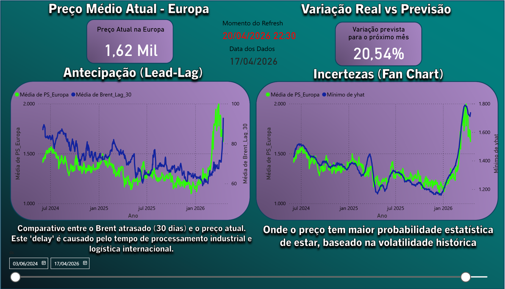

# Predição do Estireno

# 📊 Predição de Preços: Estireno (Europa vs. China)

**Status do Projeto:** 🟢 Operacional *(Atualizado via Personal Gateway)*

<a href="https://app.powerbi.com/view?r=eyJrIjoiNGJkZDE4MmItYzE2OC00MGU4LTliNzgtODljZWYyNmIxOWI0IiwidCI6IjkxZTdhZTIzLTdkOGYtNGYwNC1hZDZhLWNkYTgzNTEyZDY1OSJ9" target="_blank">
<b>Clique aqui para acessar o Dashboard Interativo</b>
</a>

---

## 📝 Descrição do Projeto

Este projeto integra uma pipeline de dados em Python com um dashboard de Business Intelligence para prever a volatilidade do mercado petroquímico europeu. O foco central é a relação de preços do Poliestireno (PS) entre a Europa e a China, utilizando o Petróleo Brent como o principal driver de custo.

Os dados utilizados são provenientes de fontes públicas e mercados financeiros reais (via Yahoo Finance), coletados exclusivamente para fins de estudo, treinamento e demonstração de competências técnicas em Engenharia de Dados e Machine Learning.

## 💡 Guia de Decisão Estratégica (Manual do Usuário)

Este dashboard foi desenhado para apoiar profissionais de **Suprimentos e Supply Chain** na tomada de decisão. Abaixo, detalhamos como utilizar cada ferramenta para otimizar a compra de insumos:

### 1. Planejamento de Compras (Página 1: Forecast)
* **O que observar:** A linha de tendência (`yhat`) e as bandas de incerteza do modelo Prophet.
* **"Compro agora para o mês que vem ou espero os preços caírem?"**
* **Ação sugerida:**  Se a linha de tendência (yhat) mostra uma subida íngreme para os próximos 30 dias e as bandas de incerteza estão estreitas, ele vai antecipar as ordens de compra para travar o preço atual. Se a tendência for de queda, compra-se apenas o estritamente necessário (mínimo de estoque) para aproveitar preços menores no futuro.
  

### 2. Gestão de Risco e Repasse de Custos (Página 1: Lead-Lag Brent)
* **O que observar:** A medida de **Sensibilidade Dinâmica**.
* **"Qual será o impacto do aumento do barril de ontem no meu custo de produção?"**
* **Ação sugerida:** Como o Brent de hoje dita o preço do PS em 30 dias (Lag), isso é importante para planejar o fluxo de caixa da fábrica. Se o Brent subiu 10 dólares, usa-se um "Fator de Repasse" (ex: 15.5) para já avisar o financeiro que o custo da tonelada vai subir aproximadamente 155 dólares no próximo mês..

### 3. Monitoramento de Sentimento do Mercado (Página 2: Correlação)
* **O que observar:** O gráfico de dispersão e o coeficiente $R^2$ das petroquímicas (**LYB/WLK**).
* **"O mercado financeiro está otimista ou pessimista?"**
* **Ação sugerida:** As ações das petroquímicas costumam reagir antes dos preços físicos. Um descolamento (ações caindo enquanto o preço físico sobe) pode indicar uma queda iminente na demanda global e Se o $R^2$ da WLK ou LYB é alto (0.85) e as ações estão caindo há uma semana, sabe-se que a demanda por plásticos está esfriando, e isso em breve chegará ao preço do Estireno. É um sinal de alerta para não estocar material caro.

### 4. Estratégia de Negociação e Arbitragem (Página 3: Simulador What-if)
* **O que observar:** O Velocímetro de Arbitragem e o Gráfico de Composição de Preço.
* **"O preço que meu fornecedor europeu está cobrando é justo?"**
* **Ação sugerida:** Pode-se simular uma queda no preço chinês mexendo no slider. Se o velocímetro mostrar que a "Janela de Importação" abriu (arbitragem positiva), há um argumento técnico fortíssimo para sentar com o fornecedor local e dizer: "O diferencial Europa-China está em 450 USD/t. Se você não me der um desconto, compensa para minha fábrica importar o material da Ásia". è a utilização do custo de importação da Ásia como um *benchmark* de preço teto.

---

## 🛠️ Glossário Técnico de Unidades

Para garantir a precisão analítica, o projeto utiliza as seguintes padronizações internacionais:

* **Polímeros (PS Europa/China):** Cotados em **USD/t** (Dólares por Tonelada Métrica).
* **Petróleo (Brent):** Cotado em **USD/bbl** (Dólares por Barril).
* **Ações (LYB/WLK):** Cotadas em **USD/share** (Dólares por Ação).
* **Sensibilidade:** Representa a variação em USD na tonelada de PS para cada 1 USD de variação no barril de petróleo.

## ⚙️ Arquitetura e Automação

Diferente de modelos estáticos, este projeto é um ecossistema vivo:

* **Coleta diária:** Um script Python executa rotinas de limpeza e modelagem diariamente.
* **Pipeline de Dados:** A extração é feita via biblioteca `yfinance`, garantindo dados atualizados de fechamento de mercado.
* **Integração em Nuvem:** O processamento ocorre localmente em um ambiente Miniconda, mas os resultados são enviados automaticamente para o Power BI Service através de um Microsoft Personal Gateway. Isso permite que o dashboard reflita as condições de mercado do dia anterior sem intervenção manual.

## 🔬 Metodologia e Machine Learning

### O Modelo Prophet "Sob o Capô"

Para a previsão de séries temporais, foi utilizado o **Facebook Prophet**, um modelo aditivo decomponível que trata dados de séries temporais como uma combinação de tendências em diferentes escalas.

A base matemática do modelo segue a fórmula:

$$y(t) = g(t) + s(t) + h(t) + \epsilon_t$$

**Onde:**
* $g(t)$ **(Tendência):** Modela mudanças não periódicas. No caso do Estireno, captura o crescimento ou declínio de longo prazo do mercado.
* $s(t)$ **(Sazonalidade):** Modela mudanças periódicas (semanal, mensal, anual) usando Séries de Fourier. Essencial para captar ciclos de manutenção de plantas petroquímicas e variações de demanda sazonal.
* $h(t)$ **(Feriados/Eventos):** Considera o efeito de datas específicas (como o Ano Novo Chinês) que impactam drasticamente o volume de negociação.
* $\epsilon_t$ **(Erro):** Representa variações atípicas não explicadas pelo modelo.

> **💡 Regressores Externos:** O modelo foi potencializado com a inclusão do `Brent_Lag_30`. Como o petróleo é a matéria-prima base, sua variação hoje impacta o preço do polímero físico em aproximadamente 30 dias. Esta variável exógena reduz significativamente o erro médio (MAE) da predição.

### 📖 Dicionário de Dados (Colunas Geradas)

* `ds`: Timestamp (Eixo temporal da análise).
* `PS_Europa`: Preço real de mercado do Poliestireno no continente europeu.
* `yhat`: A estimativa central ("preço justo") calculada pelo Machine Learning.
* `yhat_lower` / `yhat_upper`: Intervalo de confiança da previsão (Bandas de incerteza).
* `Estireno_China`: Preço de referência do mercado asiático (Benchmark global).
* `BZ=F`: Cotação em tempo real do Petróleo Brent.
* `Brent_Lag_30`: O valor do Brent deslocado em 30 dias para análise de correlação tardia.
* `Spread_Estimado`: Diferencial bruto entre os preços da Europa e China.

## 📊 Visualizações e Inteligência de Negócio

O dashboard foi estruturado em três páginas lógicas para facilitar a extração de insights:

### 1. Panorama e Forecast
Focada em *"O que aconteceu e o que virá"*.
* **Fan Chart:** Exibe o preço real contra a previsão do Prophet. As bandas de incerteza permitem que o gestor avalie o risco de volatilidade.
* **Análise Lead-Lag:** Um gráfico de eixos alinhados que sobrepõe o Brent de 30 dias atrás com o preço do PS de hoje, visualizando graficamente o repasse de custos na cadeia produtiva.

### 2. Correlação de Mercado
Focada em *"Por que aconteceu"*.
* **Dispersão de Ações (Scatter Plot):** Correlaciona o preço físico do PS com o valor das ações de grandes players (LYB/WLK). Pontos fora da curva de tendência indicam momentos de descolamento entre o mercado financeiro e a economia real.
* **Velocímetro de Spread:** Um KPI visual que monitora a saúde da margem europeia. Se o ponteiro entra na zona vermelha, a produção local está sob estresse de custos.

### 3. Simulador de Arbitragem
Focada em *"E se acontecer?"*.
* **What-if Simulator:** Permite ao usuário simular variações percentuais no preço da China.
* **Gráfico de Rosca (Composição de Preço):** Mostra quanto do preço europeu é composto pelo "piso" chinês vs. o "prêmio regional". Se o prêmio europeu cresce demais, o gráfico indica um alto risco de invasão de produtos importados da Ásia por arbitragem.

## 🚀 Tecnologias Utilizadas

* **Linguagem:** Python 3.10+
* **Bibliotecas ML:** Facebook Prophet, Pandas, NumPy
* **Data Source:** yFinance API
* **BI:** Power BI Desktop & Service (DAX Avançado)
* **Ambiente:** Miniconda (Gestão de ambientes e Gateway)

---

Desenvolvido por **Renato Benevenuto** *Engenheiro Civil | Especialista em Gestão de Projetos | Data Scientist*
